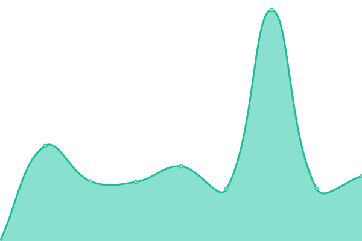

# [📈 Live Status](https://iqfareez.github.io/iium-services-status): <!--live status--> **🟩 All systems operational**

This repository contains the open-source uptime monitor and status page for [Fareez Iqmal](iqfareez.github.io), powered by [Upptime](https://github.com/upptime/upptime).

With [Upptime](https://upptime.js.org), you can get your own unlimited and free uptime monitor and status page, powered entirely by a GitHub repository. We use [Issues](https://github.com/iqfareez/iium-services-status/issues) as incident reports, [Actions](https://github.com/iqfareez/iium-services-status/actions) as uptime monitors, and [Pages](https://iqfareez.github.io/iium-services-status) for the status page.

<!--start: status pages-->
<!-- This summary is generated by Upptime (https://github.com/upptime/upptime) -->
<!-- Do not edit this manually, your changes will be overwritten -->
<!-- prettier-ignore -->
| URL | Status | History | Response Time | Uptime |
| --- | ------ | ------- | ------------- | ------ |
|  [i-Ma'luum Student Portal](https://imaluum.iium.edu.my) | 🟩 Up | [i-ma-luum-student-portal.yml](https://github.com/iqfareez/iium-services-status/commits/HEAD/history/i-ma-luum-student-portal.yml) | 

 2121ms
     
 | 

<a href="https://iiumstatus.iqfareez.com/history/i-ma-luum-student-portal">98.85%</a>
    

|  [iTa'LeEM Cloud](https://italeemc.iium.edu.my) | 🟩 Up | [i-ta-le-em-cloud.yml](https://github.com/iqfareez/iium-services-status/commits/HEAD/history/i-ta-le-em-cloud.yml) | 

 1589ms
     
 | 

<a href="https://iiumstatus.iqfareez.com/history/i-ta-le-em-cloud">100.00%</a>
    

|  [Prereg - Online Course Registration Portal](https://prereg1.iium.edu.my) | 🟩 Up | [prereg-online-course-registration-portal.yml](https://github.com/iqfareez/iium-services-status/commits/HEAD/history/prereg-online-course-registration-portal.yml) | 

 1209ms
     
 | 

<a href="https://iiumstatus.iqfareez.com/history/prereg-online-course-registration-portal">78.29%</a>
    

<!--end: status pages-->

[**Visit our status website →**](https://iqfareez.github.io/iium-services-status)

## 📄 License

- Powered by: [Upptime](https://github.com/upptime/upptime)
- Code: [MIT](./LICENSE) © [Fareez Iqmal](iqfareez.github.io)
- Data in the `./history` directory: [Open Database License](https://opendatacommons.org/licenses/odbl/1-0/)
